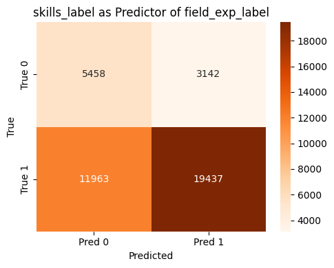
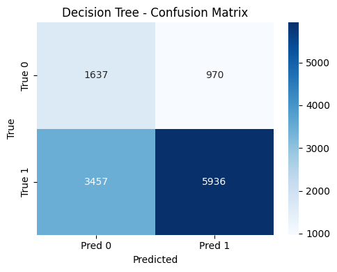

# ResumeMatch: Job–Candidate Matching using NLP & Machine Learning

ResumeMatch is an end-to-end ML/NLP system designed to evaluate how well a candidate's resume matches a job description.  
The project uses **text preprocessing**, **skill extraction**, **Sentence-BERT embeddings**, **feature engineering**,  
and **multiple ML models** to calculate a match score and provide explainability using **SHAP**.

---

## 🚀 Features

### 🔹 1. NLP Pipeline
- Resume & Job Description text cleaning  
- Tokenization, lemmatization  
- Skill and keyword extraction (n-grams)  
- Representation with **Sentence-BERT (SBERT)** embeddings  

### 🔹 2. Machine Learning Models
- XGBoost  
- Logistic Regression  
- Embedding similarity scoring  
- Hyperparameter tuning & evaluation  

### 🔹 3. Explainability
- **SHAP values** for feature impact  
- Visualization of model decision factors  

### 🔹 4. Interactive Exploration
- Jupyter Notebook with interactive widgets  
- Visual performance dashboards  

---


---

## 📊 Results & Visualizations

### **1. Embedding Similarity Visualization**


### **2. Sample Model Predictions**


### **3. Confusion Matrix**


### **4. Classification Report**


### **5. SHAP Summary Plot**


### **6. SHAP Decision Plot**


### **7. Additional Analytics**
Images 6–12 show:
- Score distributions  
- Feature importance  
- Embedding distance plots  
- Evaluation curves  

You can include them as needed:


---

## 🧠 Technologies Used

- **Python 3.11**
- **Sentence-BERT (SBERT)**
- **scikit-learn**
- **XGBoost**
- **Pandas, NumPy**
- **Matplotlib, Seaborn**
- **SHAP**
- **ipywidgets**

---

## 🏁 Getting Started

### Install dependencies:
```bash
pip install -r requirements.txt


##🤝 Contributing

Pull requests are welcome!
For major changes, please open an issue first to discuss what you would like to change.

##📜 License

This project is for academic and learning purposes.
